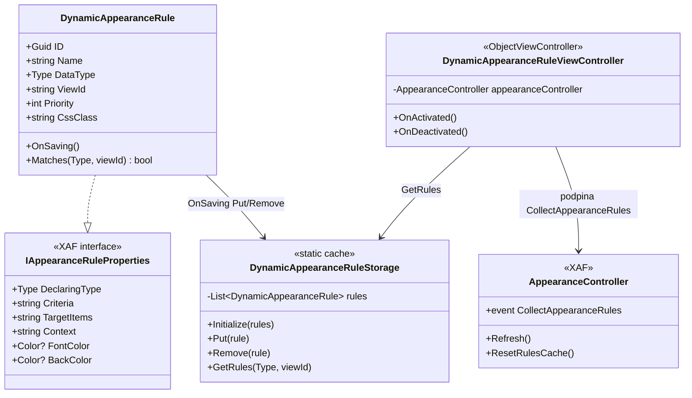
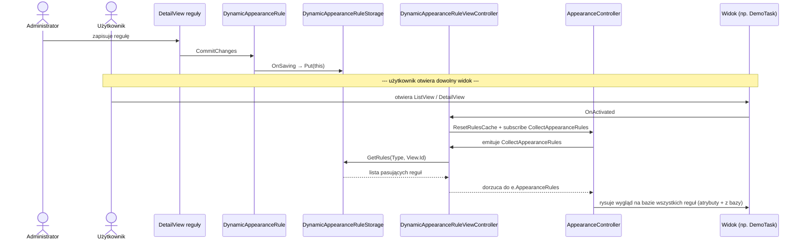

Jeżeli chcesz, żeby administrator albo wdrożeniowiec mógł sam z poziomu UI dorobić regułę „zadania po terminie świecą się na czerwono", „pracownicy na urlopie — szare tło", „kolumna `Cena` widoczna tylko dla działu finansów" — bez angażowania programisty i bez przebudowy aplikacji — musisz oddać mu kontrolę nad warstwą reguł wyglądu. Standardowy `ConditionalAppearance` w XAF tego nie daje: jego atrybuty `[Appearance]` siedzą w kodzie i każda zmiana wymaga wdrożenia nowej wersji aplikacji.

Tę lukę domyka się trzema klasami: encją `DynamicAppearanceRule`, statycznym cache'em `DynamicAppearanceRuleStorage` i kontrolerem `DynamicAppearanceRuleViewController`. Kontroler podpina cache do standardowego `AppearanceController` przez zdarzenie `CollectAppearanceRules`. Silnik patrzy na te same reguły co dla `[Appearance]` — różni się tylko źródło danych.

Tak to zrobiłem w `MainDemo.NET.EFCore`. Dalej cały kod plus krótki komentarz, co każdy fragment robi i dlaczego.

## Jak to działa — schemat klas



Klucz: `DynamicAppearanceRule` realizuje ten sam interfejs `IAppearanceRuleProperties`, na który patrzą atrybuty `[Appearance]`. `AppearanceController` traktuje obie reguły identycznie — nie potrzebujesz osobnego silnika.

## Jak to działa — przepływ od zapisu reguły do narysowania widoku



## Encja: `DynamicAppearanceRule`

```csharp
using System.ComponentModel;
using System.ComponentModel.DataAnnotations;
using System.ComponentModel.DataAnnotations.Schema;
using System.Drawing;
using DevExpress.ExpressApp;
using DevExpress.ExpressApp.ConditionalAppearance;
using DevExpress.ExpressApp.Editors;
using DevExpress.Persistent.Base;
using DevExpress.Persistent.BaseImpl.EF;
using MainDemo.Module.Storages;

namespace MainDemo.Module.BusinessObjects;

[DefaultClassOptions]
[DefaultProperty(nameof(Name))]
[ImageName("BO_Condition")]
public class DynamicAppearanceRule : BaseObject, IAppearanceRuleProperties {
    private const string DefaultCriteria = "True";
    private const string DefaultTargetItems = "*";
    private const string DefaultContext = "Any";
    private const string DefaultAppearanceItemType = "ViewItem";

    [StringLength(256)]
    public virtual string Name { get; set; }

    [Browsable(false)]
    [StringLength(512)]
    public virtual string ObjectTypeFullName { get; set; }

    [Browsable(false)]
    [StringLength(256)]
    public virtual string ObjectTypeName { get; set; }

    [NotMapped]
    [ImmediatePostData]
    public virtual Type DataType {
        get => string.IsNullOrWhiteSpace(ObjectTypeFullName) ? null : Type.GetType(ObjectTypeFullName);
        set {
            ObjectTypeFullName = value?.AssemblyQualifiedName;
            ObjectTypeName = value?.Name;
        }
    }

    [Column(TypeName = "nvarchar(max)")]
    public virtual string Criteria {
        get;
        set;
    } = DefaultCriteria;

    [StringLength(512)]
    public virtual string TargetItems {
        get;
        set;
    } = DefaultTargetItems;

    [StringLength(128)]
    public virtual string Context {
        get;
        set;
    } = DefaultContext;

    [StringLength(128)]
    public virtual string AppearanceItemType {
        get;
        set;
    } = DefaultAppearanceItemType;

    [StringLength(256)]
    public virtual string ViewId { get; set; }

    public virtual int Priority { get; set; }

    public virtual ViewItemVisibility? Visibility { get; set; }

    public virtual bool? Enabled { get; set; }

    [StringLength(64)]
    [Browsable(false)]
    public virtual string FontColorCss { get; set; }

    [StringLength(64)]
    [Browsable(false)]
    public virtual string BackColorCss { get; set; }

    [StringLength(128)]
    public virtual string CssClass { get; set; }

    [StringLength(128)]
    public virtual string Method { get; set; }

    public virtual DevExpress.Drawing.DXFontStyle? FontStyle { get; set; }

    [NotMapped]
    [Browsable(false)]
    public Type DeclaringType => DataType;

    [NotMapped]
    public Color? FontColor {
        get => ParseColor(FontColorCss);
        set => FontColorCss = ToCssColor(value);
    }

    [NotMapped]
    public Color? BackColor {
        get => ParseColor(BackColorCss);
        set => BackColorCss = ToCssColor(value);
    }

    public override void OnSaving() {
        base.OnSaving();
        var objectSpace = ((IObjectSpaceLink)this).ObjectSpace;
        if(objectSpace != null && objectSpace.IsDeletedObject(this)) {
            DynamicAppearanceRuleStorage.Remove(this);
        }
        else {
            DynamicAppearanceRuleStorage.Put(this);
        }
    }

    public bool Matches(Type objectType, string viewId) {
        if(objectType == null) {
            return false;
        }
        var currentTypeName = NormalizeTypeName(objectType.Name);
        if(!string.Equals(ObjectTypeName, currentTypeName, StringComparison.Ordinal)) {
            return false;
        }
        return string.IsNullOrWhiteSpace(ViewId) || string.Equals(ViewId, viewId, StringComparison.Ordinal);
    }

    internal static string NormalizeTypeName(string typeName) {
        const string proxySuffix = "Proxy";
        if(string.IsNullOrWhiteSpace(typeName)) {
            return typeName;
        }
        return typeName.EndsWith(proxySuffix, StringComparison.Ordinal)
            ? typeName[..^proxySuffix.Length]
            : typeName;
    }

    private static Color? ParseColor(string cssColor) {
        if(string.IsNullOrWhiteSpace(cssColor)) {
            return null;
        }
        try {
            return ColorTranslator.FromHtml(cssColor);
        }
        catch {
            return null;
        }
    }

    private static string ToCssColor(Color? color) {
        if(color == null) {
            return null;
        }
        return ColorTranslator.ToHtml(color.Value);
    }
}
```

Encja implementuje `IAppearanceRuleProperties` — ten sam interfejs, z którego XAF czyta zwykłe reguły z atrybutów. Dzięki temu `AppearanceController` traktuje ją jak każdą inną regułę, bez specjalnych ścieżek.

Pola dokładnie odpowiadają parametrom atrybutu `[Appearance]`: `Criteria`, `TargetItems`, `Context`, `AppearanceItemType`, `Priority`, `Visibility`, `Enabled`, `FontColor`, `BackColor`, `FontStyle`, `Method`. Dodatkowe są dwa: `ObjectTypeFullName` (po jakim typie filtrować) i `ViewId` (czy reguła dotyczy tylko jednego widoku, czy wszystkich).

Kolory są dwojakie: w bazie hex CSS (`#FF0000`), w API .NET — `System.Drawing.Color`. Para `FontColorCss` / `FontColor` konwertuje jedno w drugie przez `ColorTranslator`. Pole CSS nie pokazuje się w UI (`[Browsable(false)]`) — administrator pracuje na `Color` przez color picker, baza dostaje string.

`OnSaving` synchronizuje cache: po zapisie reguła trafia do `DynamicAppearanceRuleStorage`, po usunięciu — z niego znika. Bez tego użytkownik zapisałby zmianę, a UI dalej rysowałby starą wersję aż do restartu.

`NormalizeTypeName` ucina sufiks `Proxy` z nazw klas. EF Core w trybie change tracking proxies pokazuje typ jako `EmployeeProxy`, nie `Employee` — bez tej korekty `Matches` nie znajdowałby żadnego pasującego rekordu.

## Cache: `DynamicAppearanceRuleStorage`

```csharp
using DevExpress.ExpressApp.ConditionalAppearance;
using MainDemo.Module.BusinessObjects;

namespace MainDemo.Module.Storages;

public static class DynamicAppearanceRuleStorage {
    private static readonly Lock SyncRoot = new();
    private static List<DynamicAppearanceRule> rules = new();

    public static void Initialize(IEnumerable<DynamicAppearanceRule> sourceRules) {
        lock(SyncRoot) {
            rules = sourceRules
                .Where(rule => rule != null)
                .ToList();
        }
    }

    public static IReadOnlyList<DynamicAppearanceRule> GetRules() {
        lock(SyncRoot) {
            return rules.ToList();
        }
    }

    public static IReadOnlyList<IAppearanceRuleProperties> GetRules(Type objectType, string viewId) {
        lock(SyncRoot) {
            return rules
                .Where(rule => rule.Matches(objectType, viewId))
                .Cast<IAppearanceRuleProperties>()
                .ToList();
        }
    }

    public static void Put(DynamicAppearanceRule rule) {
        if(rule == null) {
            return;
        }
        lock(SyncRoot) {
            var index = rules.FindIndex(existing => existing.ID == rule.ID);
            if(index >= 0) {
                rules[index] = rule;
            }
            else {
                rules.Add(rule);
            }
        }
    }

    public static void Remove(DynamicAppearanceRule rule) {
        if(rule == null) {
            return;
        }
        lock(SyncRoot) {
            rules.RemoveAll(existing => existing.ID == rule.ID);
        }
    }
}
```

Cache jest globalny i statyczny. Reguły wczytuję raz przy starcie (`Initialize`), potem aktualizuję punktowo (`Put`/`Remove`). Trzymam wszystko pod jednym `lock` — operacji jest mało (zapisy robi administrator, czytanie idzie z listy w pamięci), więc nawet prosty zamek nie jest wąskim gardłem.

`GetRules(Type, string)` filtruje cache po typie i widoku — tę metodę wywołuje kontroler przy każdym aktywowaniu widoku.

## Kontroler: `DynamicAppearanceRuleViewController`

```csharp
using DevExpress.ExpressApp;
using DevExpress.ExpressApp.ConditionalAppearance;
using DevExpress.ExpressApp.SystemModule;
using MainDemo.Module.Storages;

namespace MainDemo.Module.Controllers;

public class DynamicAppearanceRuleViewController : ObjectViewController<ObjectView, object> {
    private AppearanceController appearanceController;

    protected override void OnActivated() {
        base.OnActivated();
        appearanceController = Frame.GetController<AppearanceController>();
        if(appearanceController == null) {
            return;
        }
        appearanceController.ResetRulesCache();
        appearanceController.CollectAppearanceRules += AppearanceController_CollectAppearanceRules;
        appearanceController.Refresh();
    }

    protected override void OnDeactivated() {
        if(appearanceController != null) {
            appearanceController.CollectAppearanceRules -= AppearanceController_CollectAppearanceRules;
            appearanceController = null;
        }
        base.OnDeactivated();
    }

    private void AppearanceController_CollectAppearanceRules(object sender, CollectAppearanceRulesEventArgs e) {
        if(View?.ObjectTypeInfo?.Type == null) {
            return;
        }
        foreach(var rule in DynamicAppearanceRuleStorage.GetRules(View.ObjectTypeInfo.Type, View.Id)) {
            e.AppearanceRules.Add(rule);
        }
    }
}
```

Kontroler aktywuje się na każdym widoku obiektowym (`ObjectView, object`). Przy `OnActivated` zdobywa `AppearanceController`, resetuje jego cache reguł i podpina się pod zdarzenie `CollectAppearanceRules`. To zdarzenie jest oficjalnym punktem rozszerzenia: zwracam tu reguły z bazy, a XAF traktuje je tak samo jak te z atrybutów.

`ResetRulesCache` jest istotne — bez niego, jeśli administrator zmieni regułę, a widok już był wcześniej otwarty, użytkownik zobaczy starą wersję cache `AppearanceController`. Reset i `Refresh` wymuszają ponowne zbieranie.

`OnDeactivated` odpina handler. Bez tego kroku dostaję klasyczny wyciek pamięci w XAF — kontroler zostaje, frame zostaje, frame trzyma referencję do widoku.

## Seed pierwszej reguły

```csharp
private void EnsureDynamicAppearanceRules() {
    if(ObjectSpace.FirstOrDefault<DynamicAppearanceRule>(rule => rule.Name == "Highlight overdue tasks") != null) {
        return;
    }

    var rule = ObjectSpace.CreateObject<DynamicAppearanceRule>();
    rule.Name = "Highlight overdue tasks";
    rule.DataType = typeof(DemoTask);
    rule.Criteria = "Status != ##Enum#MainDemo.Module.BusinessObjects.TaskStatus,Completed# && DueDate < LocalDateTimeToday()";
    rule.TargetItems = "Subject;DueDate;AssignedTo";
    rule.Context = "Any";
    rule.AppearanceItemType = nameof(ViewItem);
    rule.Priority = 10;
    rule.FontColor = Color.Firebrick;
    rule.BackColor = Color.MistyRose;
    rule.CssClass = "overdue-task";
}
```

Metoda siedzi w `Updater` i podświetla zaległe zadania na pomarańczowo. Można ją wywoływać wielokrotnie — najpierw sprawdza po nazwie, czy reguła już istnieje, i wychodzi bez duplikatów.

Na produkcji ten seed odpuszczasz. Dajesz administratorowi `ListView` na `DynamicAppearanceRule` — encja ma `[DefaultClassOptions]`, więc XAF doda ją do nawigacji bez dodatkowej pracy. Pierwszą regułę administrator zakłada wtedy ręcznie z poziomu UI.

## Testy

```csharp
using DevExpress.ExpressApp;
using MainDemo.Module.BusinessObjects;
using MainDemo.Module.Storages;
using MainDemo.WebAPI.TestInfrastructure;
using Microsoft.Extensions.DependencyInjection;
using Xunit;

namespace MainDemo.WebAPI.Tests;

public class DynamicAppearanceRuleTests : BaseWebApiTest {
    public DynamicAppearanceRuleTests(SharedTestHostHolder fixture) : base(fixture) { }

    [Fact]
    public void Seeded_dynamic_appearance_rule_exists_in_database() {
        using var scope = fixture.Host.Services.GetRequiredService<IServiceScopeFactory>().CreateScope();
        scope.ServiceProvider.Authenticate("Sam");
        using var objectSpace = scope.ServiceProvider
            .GetRequiredService<IObjectSpaceFactory>()
            .CreateObjectSpace<DynamicAppearanceRule>();

        var rule = objectSpace.FirstOrDefault<DynamicAppearanceRule>(x => x.Name == "Highlight overdue tasks");

        Assert.NotNull(rule);
        Assert.Equal(typeof(DemoTask), rule.DataType);
        Assert.Equal("Subject;DueDate;AssignedTo", rule.TargetItems);
        Assert.Equal("Any", rule.Context);
        Assert.Equal("ViewItem", rule.AppearanceItemType);
        Assert.Equal(System.Drawing.Color.Firebrick, rule.FontColor);
    }

    [Fact]
    public void Storage_returns_rules_only_for_matching_type() {
        using var scope = fixture.Host.Services.GetRequiredService<IServiceScopeFactory>().CreateScope();
        scope.ServiceProvider.Authenticate("Sam");
        using var objectSpace = scope.ServiceProvider
            .GetRequiredService<IObjectSpaceFactory>()
            .CreateObjectSpace<DynamicAppearanceRule>();
        DynamicAppearanceRuleStorage.Initialize(objectSpace.GetObjects<DynamicAppearanceRule>());

        var taskRules = DynamicAppearanceRuleStorage.GetRules(typeof(DemoTask), "AnyView");
        Assert.Contains(taskRules, rule => rule.DeclaringType == typeof(DemoTask));

        var employeeRules = DynamicAppearanceRuleStorage.GetRules(typeof(Employee), "AnyView");
        Assert.DoesNotContain(employeeRules, rule => rule.DeclaringType == typeof(DemoTask));
    }
}
```

Dwa testy pokrywają to, na czym najłatwiej coś popsuć: seed faktycznie wpadł do bazy z prawidłowym kolorem (po refaktorze pól CSS), a cache zwraca tylko reguły pasujące do typu (po refaktorze `Matches` albo `NormalizeTypeName`).

## Dlaczego ten układ działa

`AppearanceController` z XAF nie obchodzi, skąd pochodzą reguły. Pyta tylko, czy implementują `IAppearanceRuleProperties`. Atrybuty `[Appearance]` to jedno źródło, reguły z bazy — drugie. Oba trafiają do tej samej kolejki przez to samo zdarzenie `CollectAppearanceRules`.

Cały koszt wdrożenia to jedna encja, jeden statyczny cache i jeden krótki kontroler. Nie powielam silnika reguł, nie piszę własnego parsera kryteriów, nie obchodzę logiki priorytetów. To wszystko leży po stronie XAF.

Co zyskuję: administrator może z poziomu UI dorobić regułę typu „pracownicy ze statusem urlop — szare tło, podświetlenie wiersza" bez angażowania programisty i bez wdrażania nowej wersji aplikacji.

## Pełna instrukcja w repo

[Dynamiczne reguły wyglądu z bazy w XAF Blazor i WinForms](https://github.com/kashiash/MainDemoEFCoreCustomization/blob/main/CS/docs/dynamiczne-reguly-wygladu-xaf-z-bazy.md)
