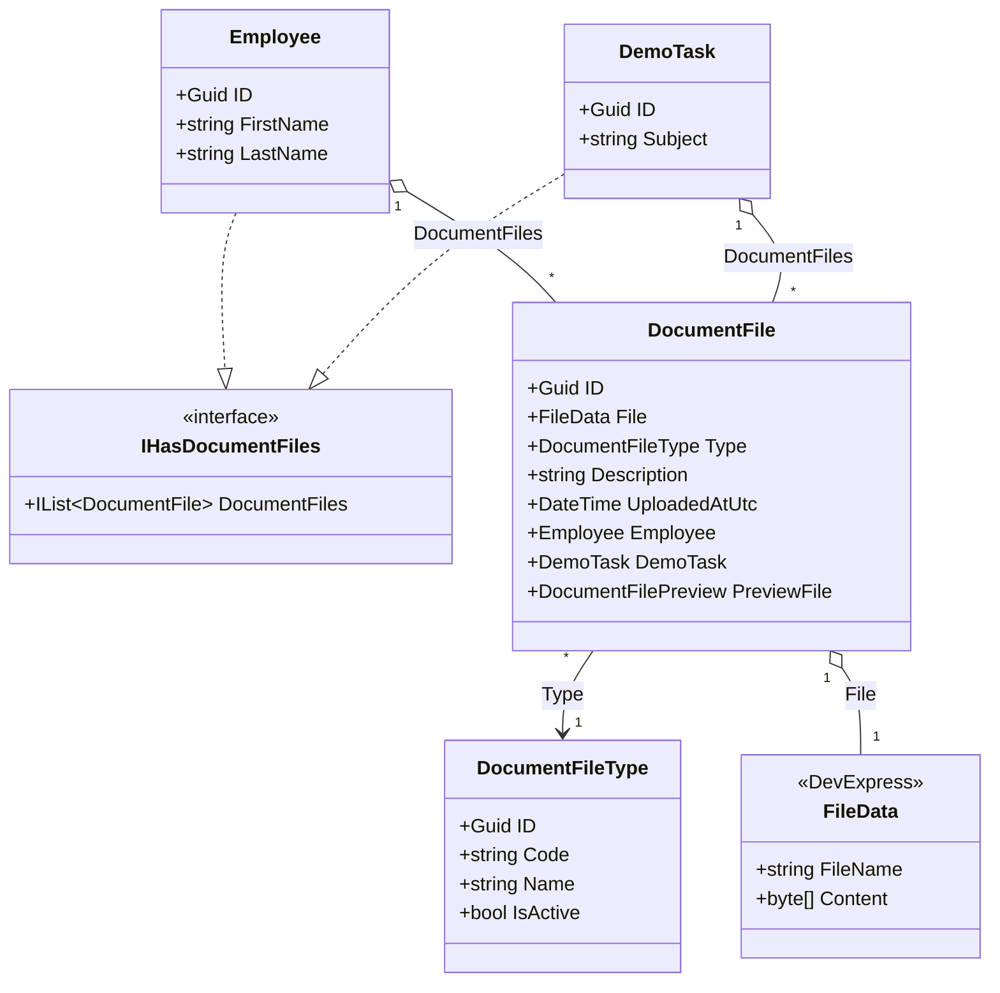
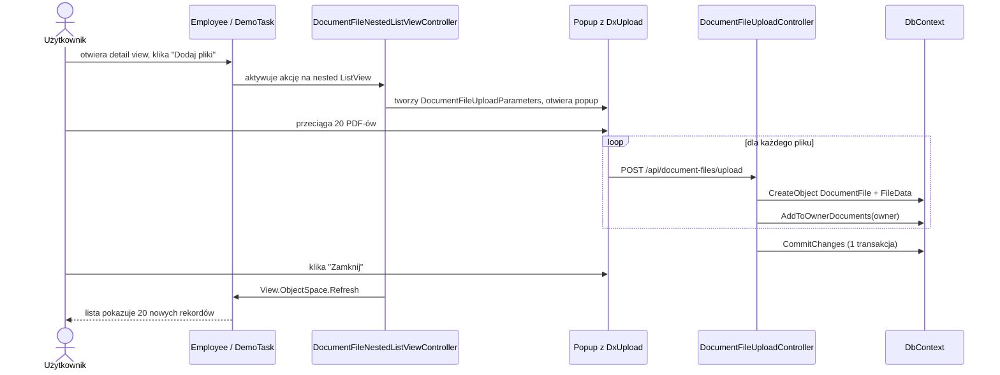

Jeżeli chcesz, żeby użytkownik mógł wrzucić do pracownika, sprawy albo dowolnego innego obiektu skany, faktury i CV — naraz, przeciągając całą paczkę z dysku — a potem otworzyć każdy plik i zobaczyć podgląd PDF bez pobierania, musisz dorobić to do XAF samodzielnie. Standardowo aplikacja przyjmuje jeden plik na raz i nie pokazuje PDF inline. Tę lukę domyka się jedną encją załącznika, kontrolerem z popupem i endpointem API.

Dalej pokazuję konkretną realizację w `MainDemo.NET.EFCore` (XAF Blazor + EF Core). Wariant działa też po podpięciu pod inne klasy, nie tylko `Employee`. PDF rysuje sama przeglądarka swoim wbudowanym czytnikiem — bez dokładania bibliotek zewnętrznych.

## Jak to działa — schemat klas



`IHasDocumentFiles` to umowa: „ta klasa może mieć załączniki". Akcja „Dodaj pliki" pokazuje się tylko nad listą zagnieżdżoną dla właściciela, który tę umowę spełnia. `DocumentFile` jest aggregowane przez właściciela, więc usunięcie pracownika usuwa też jego dokumenty.

## Jak to działa — przepływ uploadu



## Co dochodzi do projektu

Model danych: słownik typów dokumentów (`DocumentFileType`), encja dokumentu (`DocumentFile`), interfejs `IHasDocumentFiles` znaczący „ta klasa może mieć załączniki", kolekcja `DocumentFiles` na właścicielu oraz obiekt tymczasowy `DocumentFileUploadParameters` dla popupu (w terminologii XAF: „NonPersistent").

Baza: dwa `DbSet` w `DbContext` plus relacje od `DocumentFile` do właścicieli (`Employee`, `DemoTask`).

UI: kontroler `DocumentFileNestedListViewController` z akcją „Dodaj pliki", komponent `DocumentUploadAreaRenderer` z `DxUpload`, endpoint `DocumentFileUploadController` zapisujący pliki i komponent `DocumentPreviewRenderer` do podglądu PDF.

Model widoków: pole `DocumentFiles` na detail view właściciela (stąd zakładka „Załączniki") oraz pole `PreviewFile` na `DocumentFile_DetailView` (stąd podgląd PDF po otwarciu rekordu).

## Krok 1. Słownik typów dokumentów

```csharp
[DefaultClassOptions]
[ImageName("BO_Category")]
[XafDefaultProperty(nameof(Name))]
public class DocumentFileType : BaseObject {
    [RuleRequiredField]
    [RuleUniqueValue]
    [MaxLength(20)]
    public virtual string Code { get; set; }

    [RuleRequiredField]
    [MaxLength(100)]
    public virtual string Name { get; set; }

    [MaxLength(255)]
    public virtual string Description { get; set; }

    public virtual bool IsActive { get; set; } = true;
}
```

`Code` to unikalny klucz tekstowy (np. `INVOICE`, `CONTRACT`). Po nim potem szukam typu w kodzie.

## Krok 2. Encja dokumentu

```csharp
[ImageName("BO_FileAttachment")]
[XafDefaultProperty(nameof(DisplayName))]
public class DocumentFile : BaseObject {
    [RuleRequiredField]
    [EditorAlias(DevExpress.ExpressApp.Editors.EditorAliases.FileDataPropertyEditor)]
    public virtual FileData File { get; set; }

    public virtual DocumentFileType Type { get; set; }
    public virtual string Description { get; set; }
    public virtual DateTime UploadedAtUtc { get; set; }

    public virtual Employee Employee { get; set; }
    public virtual DemoTask DemoTask { get; set; }

    [NotMapped]
    [EditorAlias(EditorAliases.DocumentPreviewPropertyEditor)]
    public virtual DocumentFilePreview PreviewFile => new(File);
}
```

`DocumentFile` ma dwa pola właściciela: `Employee` i `DemoTask`. Tylko jedno z nich jest wypełnione w danym rekordzie. To wystarcza dla tej aplikacji. W większym projekcie zamieniłbym to na pojedyncze pole polimorficzne (typ + Guid), ale tutaj nie ma takiej potrzeby.

`PreviewFile` to wyliczana właściwość bez mapowania do bazy. Trzyma referencję do tego samego pliku, ale z innym edytorem — `DocumentPreviewPropertyEditor` renderuje podgląd.

## Krok 3. Interfejs i kolekcja na właścicielu

```csharp
public interface IHasDocumentFiles {
    IList<DocumentFile> DocumentFiles { get; set; }
}
```

Na `Employee` i `DemoTask`:

```csharp
[Aggregated]
public virtual IList<DocumentFile> DocumentFiles { get; set; } = new ObservableCollection<DocumentFile>();
```

Atrybut `[Aggregated]` mówi XAF, że dokumenty są częścią właściciela. Usuwasz pracownika — znikają jego dokumenty.

## Krok 4. `DbContext`

```csharp
public DbSet<DocumentFile> DocumentFiles { get; set; }
public DbSet<DocumentFileType> DocumentFileTypes { get; set; }
```

Relacje w `OnModelCreating`:

```csharp
modelBuilder.Entity<DocumentFile>()
    .HasOne(documentFile => documentFile.Employee)
    .WithMany(employee => employee.DocumentFiles)
    .OnDelete(DeleteBehavior.Cascade);

modelBuilder.Entity<DocumentFile>()
    .HasOne(documentFile => documentFile.DemoTask)
    .WithMany(task => task.DocumentFiles)
    .OnDelete(DeleteBehavior.Cascade);
```

`Cascade` zachowuje regułę z `[Aggregated]` po stronie bazy.

## Krok 5. Obiekt tymczasowy z parametrami uploadu

```csharp
[DomainComponent]
public class DocumentFileUploadParameters {
    public virtual DocumentFileType Type { get; set; }
    public virtual string Description { get; set; }
    public virtual DocumentUploadArea UploadArea { get; set; } = new();

    [Browsable(false)]
    public virtual string OwnerObjectType { get; set; }

    [Browsable(false)]
    public virtual Guid OwnerObjectId { get; set; }
}
```

`DocumentFileUploadParameters` żyje tylko w popupie i pamięci. Nie ma tabeli w bazie. Pola `OwnerObjectType` i `OwnerObjectId` są ukryte — popup je dziedziczy z otwierającego widoku i przekazuje do endpointu.

## Krok 6. Kontroler XAF z akcją „Dodaj pliki"

```csharp
public class DocumentFileNestedListViewController : ObjectViewController<ListView, DocumentFile> {
    private readonly PopupWindowShowAction addFilesAction;

    public DocumentFileNestedListViewController() {
        TargetViewNesting = Nesting.Nested;

        addFilesAction = new PopupWindowShowAction(this, "AddDocumentFiles", PredefinedCategory.RecordEdit) {
            Caption = "Dodaj pliki",
            ImageName = "BO_FileAttachment",
            AcceptButtonCaption = "Zamknij"
        };

        addFilesAction.CustomizePopupWindowParams += AddFilesAction_CustomizePopupWindowParams;
        addFilesAction.Execute += AddFilesAction_Execute;
    }

    protected override void OnActivated() {
        base.OnActivated();
        addFilesAction.Active["HasOwner"] = GetOwner() is IHasDocumentFiles;
    }

    private void AddFilesAction_CustomizePopupWindowParams(object sender, CustomizePopupWindowParamsEventArgs e) {
        if(GetOwner() is not BaseObject owner) {
            throw new UserFriendlyException("Brak obiektu nadrzędnego dla załączników.");
        }

        var popupObjectSpace = Application.CreateObjectSpace(typeof(DocumentFileUploadParameters));
        var parameters = popupObjectSpace.CreateObject<DocumentFileUploadParameters>();
        parameters.OwnerObjectType = owner.GetType().Name;
        parameters.OwnerObjectId = owner.ID;
        parameters.Type = popupObjectSpace.FirstOrDefault<DocumentFileType>(item => item.Code == "OTHER");

        e.View = Application.CreateDetailView(popupObjectSpace, "DocumentFileUploadParameters_DetailView", true, parameters);
        e.DialogController.SaveOnAccept = false;
        e.Maximized = true;
    }

    private void AddFilesAction_Execute(object sender, PopupWindowShowActionExecuteEventArgs e) {
        View.ObjectSpace.Refresh();
        View.Refresh();
    }

    private object GetOwner() {
        if(View?.CollectionSource is PropertyCollectionSource propertyCollectionSource) {
            return propertyCollectionSource.MasterObject;
        }
        return null;
    }
}
```

Kontroler aktywuje się tylko na zagnieżdżonym `ListView` dokumentów (`TargetViewNesting = Nested`). Akcja „Dodaj pliki" jest aktywna, jeśli właściciel implementuje `IHasDocumentFiles`. Po zamknięciu popupu lista się odświeża — bez tego użytkownik nie zobaczy świeżo wgranych rekordów aż do zmiany widoku.

## Krok 7. `DxUpload` z przeciąganiem wielu plików

```razor
<DxUpload Name="files"
          UploadUrl="@uploadUrl"
          AllowMultiFileUpload="true"
          UploadMode="UploadMode.Instant"
          AllowedFileExtensions="@AllowedExtensions"
          MaxFileSize="100_000_000"
          ExternalDropZoneCssSelector=".upload-drop-zone"
          ExternalSelectButtonCssSelector=".upload-select-button"
          AdditionalParameters="@additionalParams"
          FileUploaded="OnFileUploaded" />
```

Dwa kluczowe parametry: `AllowMultiFileUpload="true"` i `UploadMode="Instant"`. Pierwszy włącza wielokrotny upload, drugi wysyła każdy plik osobno od razu po wybraniu — bez przycisku „Wyślij". Użytkownik przeciąga 20 PDF-ów i serwer dostaje 20 żądań POST.

## Krok 8. Endpoint API zapisujący pliki

```csharp
[ApiController]
[Authorize]
[Route("api/document-files")]
public class DocumentFileUploadController : ControllerBase {
    private readonly INonSecuredObjectSpaceFactory objectSpaceFactory;

    public DocumentFileUploadController(INonSecuredObjectSpaceFactory objectSpaceFactory) {
        this.objectSpaceFactory = objectSpaceFactory;
    }

    [HttpPost("upload")]
    [RequestSizeLimit(100_000_000)]
    public async Task<IActionResult> Upload(
        [FromForm] List<IFormFile> files,
        [FromForm] string ownerObjectType,
        [FromForm] Guid ownerObjectId,
        [FromForm] Guid? typeId,
        [FromForm] string description) {

        using IObjectSpace objectSpace = objectSpaceFactory.CreateNonSecuredObjectSpace(typeof(DocumentFile));
        DocumentFileType documentType = ResolveDocumentType(objectSpace, typeId);

        foreach(var formFile in files.Where(item => item.Length > 0)) {
            var documentFile = objectSpace.CreateObject<DocumentFile>();
            var fileData = objectSpace.CreateObject<FileData>();

            await using var stream = formFile.OpenReadStream();
            fileData.LoadFromStream(formFile.FileName, stream);

            documentFile.File = fileData;
            documentFile.Type = documentType;
            documentFile.Description = description;
            AddToOwnerDocuments(objectSpace, documentFile, ownerObjectType, ownerObjectId);
        }

        objectSpace.CommitChanges();
        return Ok();
    }
}
```

Endpoint odbiera listę plików, tworzy dla każdego nowy `DocumentFile` z `FileData`, przypina do właściciela i zapisuje całość w jednym `CommitChanges`. Jeden commit na 20 plików — szybciej i bezpieczniej niż pojedyncze zapisy.

`INonSecuredObjectSpaceFactory` celowo omija security. Plik trafia w imieniu użytkownika autoryzowanego JWT, ale tworzenie rekordów `DocumentFile` jako zwykły użytkownik wymagałoby przyznania mu szczegółowych uprawnień na trzy klasy (`DocumentFile`, `FileData`, właściciel). Tu odpowiedzialność za autoryzację bierze sam endpoint przez `[Authorize]`.

## Krok 9. Podgląd PDF

Nie musisz pisać własnego silnika rysującego PDF — robi to przeglądarka.

```razor
@if (Extension == "pdf") {
    <object data="@ContentUrl" type="application/pdf" width="100%" height="800"></object>
}
```

Komponent przygotowuje URL do pliku, `<object>` go osadza, a samo rysowanie obsługuje wbudowany w przeglądarkę czytnik PDF. Działa identycznie na Chrome, Edge i Firefoksie.

Dla obrazów (`png`, `jpg`) używam zwykłego ``. Pozostałe rozszerzenia pokazuję jako link do pobrania.

## Krok 10. Zakładka „Załączniki" na właścicielu

W modelu widoku `Employee_DetailView` (i każdego innego właściciela) dodaję pole `DocumentFiles`. XAF sam zamienia to na zagnieżdżony `ListView` w osobnej zakładce.

Bez tego użytkownik w ogóle nie zobaczy listy dokumentów ani nie kliknie „Dodaj pliki" — akcja jest zarejestrowana dla `ListView`, a tego widoku nie ma.

## Krok 11. Detail view dokumentu

`DocumentFile_DetailView` ma cztery pola: `File`, `Type`, `Description`, `PreviewFile`. Trzy pierwsze są edytowalne. `PreviewFile` renderuje się komponentem `DocumentPreviewRenderer` — tym samym `FileData`, ale z drugim aliasem edytora.

## Wariant dla CV (`Resume`) — drobna różnica

W tym repo `Resume` już istniała jako osobna klasa z jednym plikiem CV i podglądem PDF przez `PdfViewerPropertyEditor`:

```csharp
public class Resume : BaseObject {
    [RuleRequiredField]
    public virtual Employee Employee { get; set; }

    [FileTypeFilter("pdf-only", "PDF file", "*.pdf")]
    public virtual FileData File { get; set; }

    [EditorAlias(EditorAliases.PdfViewerPropertyEditor)]
    public FileData ResumeView => File;
}
```

Brakowało tylko jednego: hurtowego dodawania wielu CV przez drag and drop. Dołożyłem to równolegle do mechanizmu dokumentów: `ResumeUploadParameters`, `ResumeNestedListViewController`, `ResumeUploadAreaPropertyEditor`, `ResumeUploadAreaRenderer` i `ResumeUploadController`. Schemat ten sam co dla dokumentów, z dwiema różnicami: popup trzyma tylko `EmployeeId` (jedno pole właściciela), a endpoint odrzuca rozszerzenia inne niż `.pdf`.

```csharp
addResumesAction = new PopupWindowShowAction(this, "AddEmployeeResumes", PredefinedCategory.RecordEdit) {
    Caption = "Dodaj CV",
    ImageName = "BO_Resume",
    AcceptButtonCaption = "Zamknij"
};
```

Renderer i ustawienia:

```razor
<DxUpload Name="files"
          UploadUrl="@UploadUrl"
          AllowMultiFileUpload="true"
          UploadMode="UploadMode.Instant"
          AllowedFileExtensions="@AllowedExtensions"
          AdditionalParameters="@AdditionalParameters" />
```

```csharp
private const string UploadUrl = "/api/resumes/upload";
private static readonly List<string> AllowedExtensions = [".pdf"];
```

Efekt: w detail view pracownika jest zakładka „CV", w niej lista `Resumes`, użytkownik klika „Dodaj CV", przeciąga wiele PDF-ów i każdy zapisuje się jako osobny rekord `Resume`. Po otwarciu rekordu działa standardowy podgląd PDF z `ResumeView`.

## Komendy

Build:

```powershell
dotnet build CS\MainDemo.NET.EFCore.sln -c Debug
```

Testy:

```powershell
dotnet test CS\MainDemo.WebAPI.Tests\MainDemo.WebAPI.Tests.csproj -c Debug --filter "DocumentFileUploadTests|DynamicAppearanceRuleTests|LocalizationTests"
```

Start aplikacji:

```powershell
dotnet run --no-launch-profile --project CS/MainDemo.Blazor.Server/MainDemo.Blazor.Server.csproj -c Debug --urls http://127.0.0.1:5115
```

## Co sprawdzić ręcznie

Przed uznaniem za zrobione: czy właściciel ma zakładkę „Załączniki", czy jest przycisk „Dodaj pliki", czy popup otwiera się poprawnie, czy można przeciągnąć wiele PDF-ów naraz, czy lista odświeża się po zamknięciu popupu, czy każdy plik utworzył osobny rekord i czy PDF jest widoczny inline po otwarciu rekordu.

Pełny opis repozytoryjny tej zmiany żyje w repo projektu: [Obsługa skanów i podglądu PDF w MainDemo Blazor](https://github.com/kashiash/MainDemoEFCoreCustomization/blob/main/CS/docs/obsluga-skanow-i-podgladu-pdf-w-main-demo-blazor.md).
