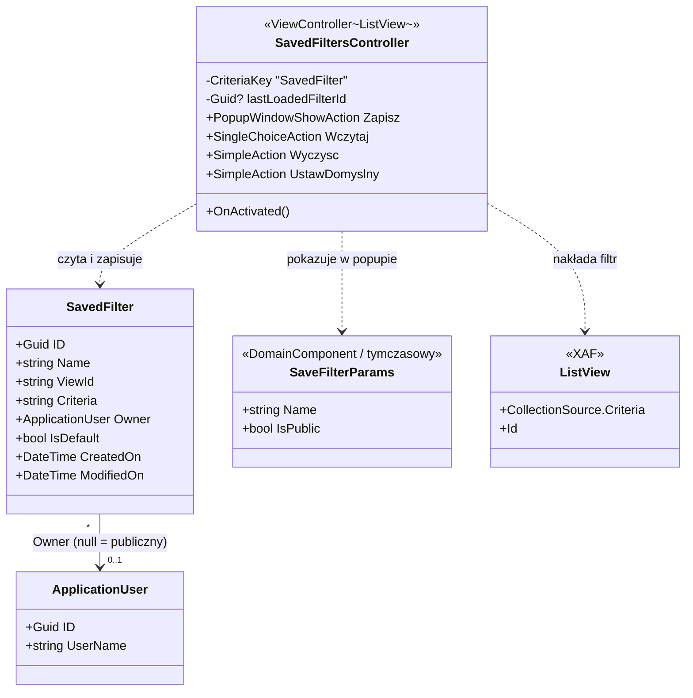
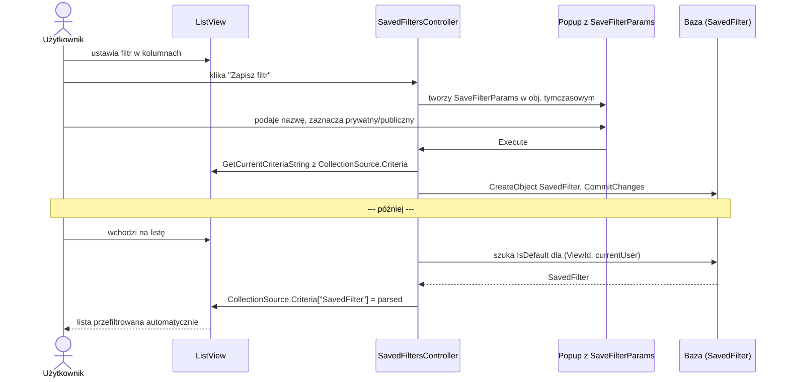

Użytkownik ustawia filtr na liście, wychodzi z widoku, wraca — filtr znikł. XAF filtrów nie zapamiętuje.

Jedna encja i jeden kontroler rozwiązują ten problem. Cztery operacje: zapisz filtr pod nazwą, wczytaj z listy, wyczyść, ustaw jako domyślny — przy następnym wejściu nakłada się automatycznie. Filtr może być prywatny (tylko autor) albo publiczny (cały zespół). Bez zewnętrznych bibliotek. Działa identycznie w Blazor i WinForms.

## Aktualizacja po wdrożeniu w DataDrive

W naszym wdrożeniu nie dodałem nowej encji `SavedFilter` obok istniejących mechanizmów. Rozbudowałem istniejący `ViewFilter`.

To znaczy, że finalnie w kodzie doszły do `ViewFilter` pola:

- `Owner`
- `AllowPublic`
- `Default`
- `ViewId`

To ważna decyzja architektoniczna. Jeżeli aplikacja ma już własny mechanizm filtrów, lepiej go rozwinąć, niż utrzymywać dwa równoległe modele zapisanych filtrów.

Druga ważna decyzja: **nowy filtr tworzony przez użytkownika jest prywatny domyślnie**. W praktyce wygląda to tak:

1. użytkownik klika `Save Filter`,
2. filtr dostaje `AllowPublic = false`,
3. jeżeli chce go udostępnić zespołowi, musi sam zaznaczyć checkbox publiczności.

To bezpieczniejsze niż odwrotny wariant. Nie ma ryzyka, że użytkownik przez przypadek wystawi zespołowi własny roboczy filtr.

## Jak to działa — schemat klas

Zanim wejdziesz w kod, zobacz, z czego składa się rozwiązanie. Diagram pokazuje cztery klasy i ich powiązania: encję filtra, użytkownika, obiekt popupu i kontroler. Odczytasz z niego, kto co trzyma i kto kogo woła.



`Owner = null` oznacza filtr publiczny. Kontroler zapisuje własne kryterium pod kluczem `"SavedFilter"` w słowniku `CollectionSource.Criteria` — i nie rusza innych filtrów (np. z paska wyszukiwania).

W `DataDrive` finalna wersja jest lekko inna:

1. używany jest istniejący `ViewFilter`,
2. filtry systemowe seedowane przez `Updater` są jawnie publiczne,
3. filtry użytkownika tworzone z UI startują jako prywatne,
4. `ViewId` ogranicza filtr do konkretnego widoku, a nie tylko typu encji.

## Jak to działa — przepływ zapisu i wczytania

Diagram klas mówi, *co* jest w grze. Ten pokazuje *kiedy* — kolejność zdarzeń od kliknięcia użytkownika po nałożony filtr. Najpierw ścieżka zapisu, niżej (za linią „później") automatyczne wczytanie przy następnym wejściu na listę.



## Co użytkownik widzi

Cztery akcje w sekcji „Search" na pasku listy:

- **Zapisz filtr** — popup z nazwą i przełącznikiem prywatny/publiczny.
- **Wczytaj filtr** — lista filtrów dla bieżącego widoku.
- **Wyczyść filtr** — kasuje aktywne kryterium.
- **Ustaw jako domyślny** — zapamiętuje ostatnio wczytany filtr jako startowy.

Przy następnym wejściu na listę domyślny filtr nakłada się automatycznie.

## Cztery elementy implementacji

### 1. Encja `SavedFilter`

EF Core, w tym samym `DbContext` co reszta aplikacji.

```csharp
[DefaultClassOptions]
[ModelDefault("Caption", "Saved Filter")]
[DefaultProperty(nameof(Name))]
public class SavedFilter : BaseObject {
    [RuleRequiredField("SavedFilter_Name_Required", DefaultContexts.Save)]
    public virtual string Name { get; set; }

    [RuleRequiredField("SavedFilter_ViewId_Required", DefaultContexts.Save)]
    [ModelDefault("AllowEdit", "False")]
    public virtual string ViewId { get; set; }

    [RuleRequiredField("SavedFilter_Criteria_Required", DefaultContexts.Save)]
    [FieldSize(FieldSizeAttribute.Unlimited)]
    [ModelDefault("RowCount", "5")]
    public virtual string Criteria { get; set; }

    public virtual ApplicationUser Owner { get; set; }
    public virtual bool IsDefault { get; set; }
    public virtual DateTime CreatedOn { get; set; }
    public virtual DateTime ModifiedOn { get; set; }

    public override void OnCreated() {
        base.OnCreated();
        CreatedOn = DateTime.UtcNow;
        ModifiedOn = CreatedOn;
    }

    public override void OnSaving() {
        base.OnSaving();
        ModifiedOn = DateTime.UtcNow;
    }

    public override string ToString() => Name;
}
```

Jeżeli masz już w projekcie coś w rodzaju `ViewFilter`, praktyczniejszy wariant jest taki jak u nas:

1. nie tworzysz nowej encji `SavedFilter`,
2. rozszerzasz istniejącą encję filtrów o `Owner`, `AllowPublic`, `Default`, `ViewId`,
3. zachowujesz kompatybilność z dotychczasowym UI i seedami.

Decyzje warte zapamiętania:

- **`Criteria` jako string.** `CriteriaOperator` nie jest serializowalny. Standardowy zapis to `criteria.ToString()` plus `CriteriaOperator.Parse(...)` przy odczycie. Dzięki temu filtr przeżyje restart i przeniesie się między procesami.
- **`Owner` jako nullowalne FK do `ApplicationUser`.** `Owner == null` znaczy „publiczny". Jedna kolumna mniej i naturalne SQL.
- **`ViewId` jako string.** `View.Id` w XAF to stringowy identyfikator z modelu (`"Employee_ListView"`). Trzymamy go dosłownie, bez enuma.

Rejestracja w `DbContext`:

```csharp
public DbSet<SavedFilter> SavedFilters { get; set; }
```

I indeks w `OnModelCreating`, żeby wyszukiwanie po widoku było szybkie:

```csharp
modelBuilder.Entity<SavedFilter>()
    .HasIndex(f => new { f.ViewId, f.Owner });
```

### 2. `SaveFilterParams` — popup z nazwą

Obiekt tymczasowy (w terminologii XAF: „NonPersistent"). Żyje wyłącznie w pamięci popupu, nie ma tabeli w bazie. Służy tylko do zebrania dwóch pól.

```csharp
[DomainComponent]
[ModelDefault("Caption", "Save Filter")]
public class SaveFilterParams : NonPersistentBaseObject {
    public SaveFilterParams() : base() { }
    public SaveFilterParams(Guid oid) : base(oid) { }

    [RuleRequiredField("SaveFilterParams_Name_Required", DefaultContexts.Save)]
    public string Name { get; set; }

    [ToolTip("Publiczny filtr jest widoczny dla wszystkich użytkowników")]
    public bool IsPublic { get; set; }
}
```

To samo robi wbudowana akcja „Save Layout" w XAF — popup z `DomainComponent` i `PopupWindowShowAction`.

### 3. ViewController

Cztery akcje. W `OnActivated` kontroler nakłada domyślny filtr.

```csharp
public class SavedFiltersController : ViewController<ListView> {
    private const string CriteriaKey = "SavedFilter";

    private readonly PopupWindowShowAction saveFilterAction;
    private readonly SingleChoiceAction loadFilterAction;
    private readonly SimpleAction clearFilterAction;
    private readonly SimpleAction setDefaultAction;

    private Guid? lastLoadedFilterId;

    public SavedFiltersController() {
        TargetViewType = ViewType.ListView;

        saveFilterAction = new PopupWindowShowAction(this, "SaveCurrentFilter", PredefinedCategory.Search) {
            Caption = "Zapisz filtr",
            ImageName = "MenuBar_Save"
        };
        saveFilterAction.CustomizePopupWindowParams += SaveFilterAction_CustomizePopupWindowParams;
        saveFilterAction.Execute += SaveFilterAction_Execute;

        loadFilterAction = new SingleChoiceAction(this, "LoadSavedFilter", PredefinedCategory.Search) {
            Caption = "Wczytaj filtr",
            ImageName = "Action_Filter",
            ItemType = SingleChoiceActionItemType.ItemIsOperation,
            ShowItemsOnClick = true
        };
        loadFilterAction.Execute += LoadFilterAction_Execute;

        clearFilterAction = new SimpleAction(this, "ClearSavedFilter", PredefinedCategory.Search) {
            Caption = "Wyczyść filtr",
            ImageName = "Action_ClearFilter"
        };
        clearFilterAction.Execute += ClearFilterAction_Execute;

        setDefaultAction = new SimpleAction(this, "SetSavedFilterAsDefault", PredefinedCategory.Search) {
            Caption = "Ustaw jako domyślny",
            ImageName = "BO_Validation_Rule_Default_Value"
        };
        setDefaultAction.Execute += SetDefaultAction_Execute;
    }

    protected override void OnActivated() {
        base.OnActivated();
        PopulateLoadFilterItems();
        ApplyDefaultFilter();
        UpdateSetDefaultEnabled();
    }

    protected override void OnDeactivated() {
        lastLoadedFilterId = null;
        base.OnDeactivated();
    }
}
```

**Wczytywanie listy zapisanych filtrów.** Metoda `PopulateLoadFilterItems` zasila rozwijaną akcję „Wczytaj filtr". Pobiera filtry przypisane do bieżącego widoku i widoczne dla użytkownika — własne plus publiczne — i z każdego robi pozycję menu:

```csharp
private void PopulateLoadFilterItems() {
    loadFilterAction.Items.Clear();
    Guid currentUserId = SecuritySystem.CurrentUserId is Guid id ? id : Guid.Empty;
    CriteriaOperator criteria = CriteriaOperator.Parse(
        "ViewId = ? AND (Owner is null OR Owner.ID = ?)",
        View.Id, currentUserId);
IList<SavedFilter> filters = ObjectSpace.GetObjects<SavedFilter>(criteria);
    foreach(SavedFilter filter in filters) {
        string caption = filter.Owner == null ? $"{filter.Name} (publiczny)" : filter.Name;
        loadFilterAction.Items.Add(new ChoiceActionItem(caption, filter.ID));
    }
    loadFilterAction.Active.SetItemValue("HasItems", loadFilterAction.Items.Count > 0);
}
```

W adaptacji do `DataDrive` rozszerzyłem ten warunek o dopasowanie do `ViewId`, żeby filtr zapisany dla jednego `ListView` tej samej encji nie wpadał automatycznie na inny widok.

**Zapis aktualnego filtra.** Po zatwierdzeniu popupu kod bierze aktywne kryterium z listy, tworzy obiekt `SavedFilter` i zapisuje go. Filtr prywatny dostaje właściciela, publiczny zostaje bez:

```csharp
private void SaveFilterAction_CustomizePopupWindowParams(object sender, CustomizePopupWindowParamsEventArgs e) {
    IObjectSpace popupObjectSpace = Application.CreateObjectSpace(typeof(SaveFilterParams));
    SaveFilterParams parameters = popupObjectSpace.CreateObject<SaveFilterParams>();
    e.View = Application.CreateDetailView(popupObjectSpace, parameters);
}

private void SaveFilterAction_Execute(object sender, PopupWindowShowActionExecuteEventArgs e) {
    SaveFilterParams parameters = (SaveFilterParams)e.PopupWindowViewCurrentObject;
    string criteriaString = GetCurrentCriteriaString();
    if(string.IsNullOrWhiteSpace(criteriaString)) {
        throw new UserFriendlyException("Brak aktywnego filtra do zapisania. Najpierw ustaw filtr na liście.");
    }

    using IObjectSpace os = Application.CreateObjectSpace(typeof(SavedFilter));
    SavedFilter filter = os.CreateObject<SavedFilter>();
    filter.Name = parameters.Name;
    filter.ViewId = View.Id;
    filter.Criteria = criteriaString;
if(!parameters.IsPublic) {
    Guid currentUserId = SecuritySystem.CurrentUserId is Guid id ? id : Guid.Empty;
    filter.Owner = os.GetObjectByKey<ApplicationUser>(currentUserId);
}
os.CommitChanges();

    PopulateLoadFilterItems();
}
```

W realnym wdrożeniu ustaw to jeszcze jednoznaczniej:

```csharp
filter.AllowPublic = false;
```

Dopiero checkbox w formularzu to zmienia. Właśnie tak zrobiłem u nas.

**Nałożenie filtra na listę.** To jeden wpis do słownika kryteriów pod własnym kluczem. XAF dołoży go operatorem AND do pozostałych aktywnych filtrów i odświeży widok:

```csharp
private void ApplyCriteria(SavedFilter filter) {
    CriteriaOperator parsed = CriteriaOperator.Parse(filter.Criteria);
    View.CollectionSource.Criteria[CriteriaKey] = parsed;
    lastLoadedFilterId = filter.ID;
    UpdateSetDefaultEnabled();
}
```

`View.CollectionSource.Criteria` to słownik z nazwanymi kryteriami. XAF łączy wszystkie aktywne wpisy operatorem AND. Klucz `"SavedFilter"` to nasz wpis — możemy go nadpisać albo usunąć. Pozostałe filtry (np. z paska wyszukiwania) nie zmieniają się.

**Odczyt aktywnych kryteriów.** Zanim zapiszesz filtr, trzeba zebrać to, co użytkownik naprawdę ustawił. Kod łączy wszystkie aktywne kryteria w jeden string i pomija własny klucz, żeby nie zapisać filtra wewnątrz filtra:

```csharp
private string GetCurrentCriteriaString() {
    CriteriaOperator combined = null;
    foreach(string key in View.CollectionSource.Criteria.Keys) {
        if(key == CriteriaKey) {
            continue;
        }
        CriteriaOperator value = View.CollectionSource.Criteria[key];
        if(ReferenceEquals(value, null)) {
            continue;
        }
        combined = ReferenceEquals(combined, null)
            ? value
            : CriteriaOperator.And(combined, value);
    }
    return ReferenceEquals(combined, null) ? null : combined.ToString();
}
```

Pomijamy własny klucz `"SavedFilter"` — gdyby został w słowniku z poprzedniej operacji, doszłoby do zapisu kryterium wewnątrz kryterium.

**Automatyczne nałożenie domyślnego filtra.** Przy wejściu na listę kontroler szuka filtra oznaczonego jako domyślny dla pary (widok, użytkownik) i od razu go nakłada. Użytkownik dostaje swój zestaw bez klikania:

```csharp
private void ApplyDefaultFilter() {
    Guid currentUserId = SecuritySystem.CurrentUserId is Guid id ? id : Guid.Empty;
    CriteriaOperator criteria = CriteriaOperator.Parse(
        "ViewId = ? AND IsDefault = True AND (Owner.ID = ? OR Owner is null)",
        View.Id, currentUserId);
    SavedFilter defaultFilter = ObjectSpace.FindObject<SavedFilter>(criteria);
    if(defaultFilter != null) {
        ApplyCriteria(defaultFilter);
    }
}
```

### 4. Migracja schematu — nie trzeba

`MainDemoBlazorApplication` ma ustawione:

```csharp
DatabaseUpdateMode = DatabaseUpdateMode.UpdateDatabaseAlways;
```

Przy starcie XAF dorzuca tabelę dla `SavedFilter` sam. Nie generujemy migracji EF Core ręcznie.

Jeżeli twoja aplikacja używa innego trybu (np. `UpdateDatabaseBeforeOpen` z ręcznymi migracjami), wygeneruj migrację standardowo:

```powershell
dotnet ef migrations add AddSavedFilter -p MainDemo.Module
```

## Pułapki

**`View.CollectionSource.Criteria` to słownik, nie kolekcja `CriteriaOperator`.** Iterujesz przez `.Keys` i pobierasz po kluczu, albo używasz `.Values.Aggregate(CriteriaOperator.And)`. Bezpośrednie `foreach (var x in Criteria)` nie działa tak, jak myślisz. Enumerator zwraca samo `CriteriaOperator`, nie `KeyValuePair<string, CriteriaOperator>`. Trzymaj się dostępu przez klucz.

**Nie ma `FilterController.GetCombinedCriteria()`.** Wszystkie aktywne filtry (filtr kolumnowy w gridzie, full-text search, ręcznie ustawione kryteria) trafiają do tego samego słownika `View.CollectionSource.Criteria`. Iterujesz go i łączysz operatorem AND.

**`CriteriaOperator.Parse` z parametrem obiektowym.** Kiedy filtr odwołuje się do obiektu XAF, lepiej parsować w `IObjectSpace` (przez `ObjectSpace.ParseCriteria`). Surowy `CriteriaOperator.Parse(string)` może nie zrekonstruować referencji do obiektów. Dla prostych kryteriów (porównania pól, daty, stringi) wystarczy `CriteriaOperator.Parse`.

**Permisje na `SavedFilter`.** Bez tego użytkownicy nie zobaczą tabeli. W `Updater.UpdateDatabaseAfterUpdateSchema` dorzuć dla domyślnej roli pełne CRUD na własnych filtrach (kryterium `Owner.ID = CurrentUserId() || Owner is null`).

## Co przetestować

- Zapisz filtr prywatny — widoczny tylko dla autora.
- Zapisz filtr publiczny — widoczny dla wszystkich.
- Nowy filtr bez zaznaczenia checkboxa publiczności — zostaje prywatny.
- Wczytaj filtr — kryterium nakłada się na listę.
- Wyczyść filtr — lista wraca do pełnego zbioru.
- Domyślny dla użytkownika A nie wpływa na widok użytkownika B.
- Filtr zapisany dla jednego `ViewId` nie pojawia się automatycznie na innym widoku tej samej encji.
- Restart aplikacji — domyślny filtr nakłada się automatycznie.

## Co zostawić na drugą iterację

- Edycję filtra po zapisaniu (tylko zapisz/usuń w pierwszej wersji).
- Współdzielenie między rolami (publiczny jest globalny — wszystko albo nic).
- `DashboardView` i `LookupListView` (działa tylko na zwykłym `ListView`).
- Zapis sortowania razem z filtrem.

To nie są krytyczne braki. Pierwsza iteracja ma rozwiązać problem „filtr przepada po wyjściu z widoku" — i tyle robi.

## Kiedy ten wzorzec się sprawdza

Wszędzie tam, gdzie użytkownik wraca do tej samej listy z tym samym zestawem filtrów. Lista zadań do zrobienia: „moje, otwarte, na ten tydzień". Lista zamówień: „po terminie, niezafakturowane". Lista pracowników: „z mojego działu, na urlopie w tym miesiącu".
