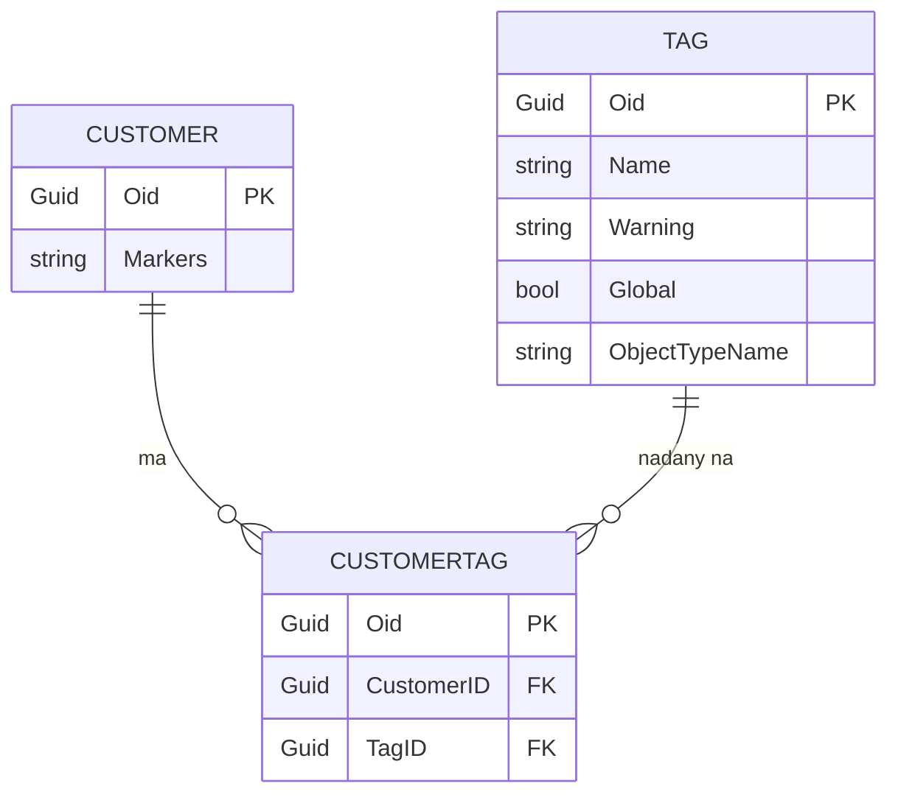
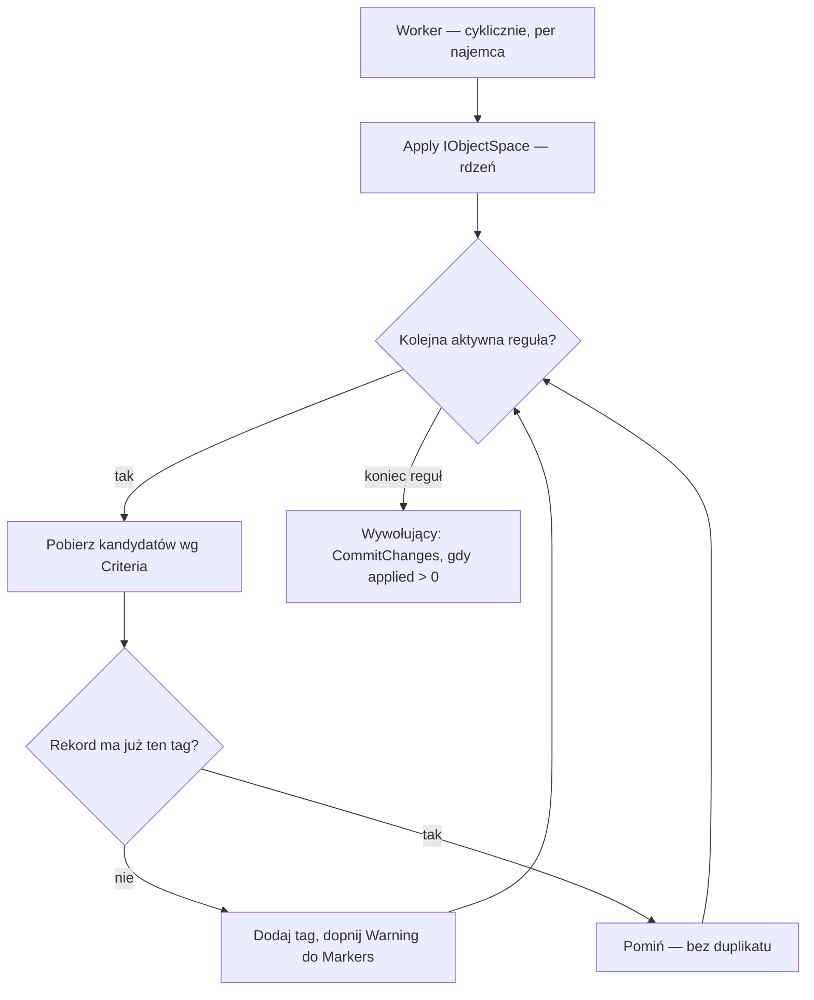
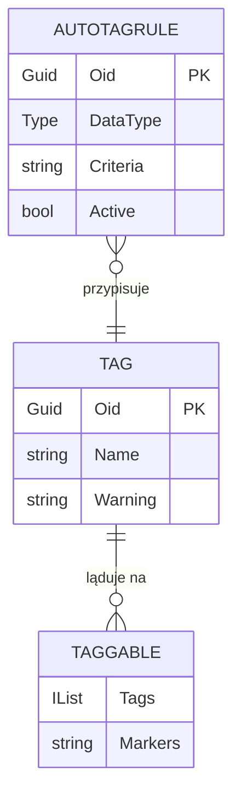

Chcesz, żeby użytkownik oznaczał rekordy etykietami i filtrował po nich listy? Musisz dorobić kilka rzeczy. Część etykiet ma się nadawać sama, według warunku. Razem składa się to na encję tagu, relację wiele-do-wielu, kontroler akcji i silnik reguł. Standardowy XAF nie daje tego z pudełka. Dalej pokazuję działający komplet na EF Core i PostgreSQL.

## Po co to użytkownikowi

Wyobraź sobie trzy sytuacje z floty. Handlowiec chce widzieć klientów „VIP". Księgowa filtruje faktury oznaczone jako „sporne". Serwisant szuka pojazdów „do serwisu".

Tag obsłuży wszystkie te przypadki tym samym mechanizmem. Jedna etykieta wisi na wielu rekordach, jeden rekord ma wiele etykiet. Do tego dochodzi automat: reguła „faktura przeterminowana → tag Przeterminowana" nadaje etykietę bez kliknięcia.

## Encja tagu i wspólny interfejs

Tag trzyma nazwę, opcjonalne ostrzeżenie i zawężenie do typu obiektu. Ostrzeżenie to krótki tekst, który trafia na oznaczony rekord — np. „Wymagane pełnomocnictwo".

```csharp
public class Tag : AuditBaseObject {
    public virtual string Name { get; set; }
    public virtual string Warning { get; set; }      // tekst dopinany do rekordu
    public virtual bool Global { get; set; }          // dostępny dla każdego typu
    public virtual string ObjectTypeName { get; set; } // albo zawężony do typu
    // kolekcje zwrotne: Customers, Vehicles, FinancialDocuments
}
```

Encje, które chcesz tagować, dostają wspólny interfejs. To on pozwala napisać jeden kontroler i jeden automat dla wszystkich typów naraz.

```csharp
public interface ITaggable {
    IList<Tag> Tags { get; set; }
    string Markers { get; set; }   // „Znaczniki" — zagregowany tekst z tagów
}
```

U mnie interfejs noszą `Customer`, `Vehicle` i `FinancialDocument`. Ten ostatni to baza hierarchii faktur, więc tag obejmuje wszystkie podklasy.

## Relacja wiele-do-wielu przez jawną encję łączącą

Tag i rekord łączy trzecia tabela. Zapisuje pojedyncze pary „ten klient ma ten tag". W EF Core masz dwie drogi: niejawną i jawną.

Wybierz jawną — własną klasę z pojedynczym kluczem Guid. Przy niejawnej relacji (sama kolekcja `Tags` plus `HasMany().WithMany()`) `dotnet ef migrations` bywa zawodne i wymaga ręcznej poprawki nazw kolumn. XAF też woli pojedynczy klucz, nie złożony.



*Encja łącząca `CustomerTag` ma własny klucz `Oid` i dwa klucze obce: `CustomerID`, `TagID` — przy relacji niejawnej ich nazwy bywają błędne.*

```csharp
public class CustomerTag : OutlookInspiredBaseObject {
    public virtual Customer Customer { get; set; }
    public virtual Tag Tag { get; set; }
}
```

Relację konfigurujesz w `OnModelCreating`:

```csharp
modelBuilder.Entity<Customer>()
    .HasMany(c => c.Tags)
    .WithMany(t => t.Customers)
    .UsingEntity<CustomerTag>(
        right => right.HasOne(ct => ct.Tag).WithMany().OnDelete(DeleteBehavior.Cascade),
        left  => left.HasOne(ct => ct.Customer).WithMany().OnDelete(DeleteBehavior.Cascade));
```

Cena? Jedna encja łącząca na każdy tagowalny typ. W zamian masz stabilne migracje.

## Ręczne tagowanie — jeden kontroler na wszystkie typy

Dzięki interfejsowi `ITaggable` piszesz kontroler raz. Działa na liście dowolnej tagowalnej encji.

```csharp
public class TaggableListViewController : ObjectViewController<ListView, ITaggable> {
    // akcje: Dodaj tag, Filtruj po tagu, Usuń tag (PopupWindowShowAction)
}
```

Akcja „Dodaj tag" otwiera popup z listą tagów. Lista pokazuje tylko tagi danego typu albo globalne:

```csharp
listView.CollectionSource.Criteria[FilterKey] =
    CriteriaOperator.Parse("Archival = False And (Global = True Or ObjectTypeName = ?)", targetTypeName);
```

Po wyborze tag ląduje na zaznaczonych rekordach, a tekst z jego pola `Warning` dopina się do pola `Markers` („Znaczniki"). To pole pokazujesz domyślnie jako pierwszą kolumnę listy — przez `[ModelDefault("Index","0")]` i `[VisibleInListView(true)]`. Filtr listy używa składni kolekcyjnej XAF:

```csharp
View.CollectionSource.Criteria[FilterKey] = CriteriaOperator.Parse("Tags[ID = ?]", tag.ID);
```

Jeśli chcesz, żeby użytkownik zapisywał takie filtry na stałe, opisałem to w osobnym wpisie o [zapisywanych filtrach list]().

## Automat — reguła, rdzeń i worker

Automat ma trzy części. Reguła mówi „co i komu", rdzeń ją wykonuje, a worker — usługa chodząca w tle serwera — odpala rdzeń cyklicznie, bez udziału użytkownika.



Reguła to zwykła encja. Warunek wpisujesz w edytorze kryteriów XAF:

```csharp
public class AutoTagRule : BaseObject {
    public Type DataType { get; set; }        // np. Vehicle
    public virtual string Criteria { get; set; } // np. Contains(RegistrationNo, 'SERWIS')
    public virtual Tag Tag { get; set; }
    public virtual bool Active { get; set; } = true;
}
```



Rdzeń celowo oddzieliłem od interfejsu i od wątku w tle. Bierze `IObjectSpace`, przechodzi aktywne reguły, nakłada tagi i zwraca liczbę nowych. Nie woła `CommitChanges` — robi to wywołujący:

```csharp
public int Apply(IObjectSpace objectSpace) {
    var newlyTagged = 0;
    var rules = objectSpace
        .GetObjects<AutoTagRule>(CriteriaOperator.Parse("Active = True And Tag Is Not Null"))
        .ToList();

    foreach (var rule in rules) {
        var type = rule.DataType;
        if (type == null || string.IsNullOrWhiteSpace(rule.Criteria)) continue;
        if (!typeof(ITaggable).IsAssignableFrom(type)) continue;

        var candidates = objectSpace.GetObjects(type, CriteriaOperator.Parse(rule.Criteria));
        var tag = objectSpace.GetObject(rule.Tag);

        foreach (var candidate in candidates) {
            if (candidate is not ITaggable taggable) continue;
            if (taggable.Tags.Contains(tag)) continue;
            taggable.Tags.Add(tag);
            ApplyWarning(taggable, tag);
            newlyTagged++;
        }
    }
    return newlyTagged;
}
```

Dwa guardy nie są ozdobą: reguła bez `Criteria` albo wskazująca typ, który nie jest `ITaggable`, jest po prostu pomijana — automat nie wywraca się na błędnej konfiguracji.

`ApplyWarning` dopina tekst z pola `Warning` taga do pola `Markers` rekordu. Bez duplikatów, sklejając wpisy przez `"; "`:

```csharp
private static void ApplyWarning(ITaggable taggable, Tag tag) {
    if (string.IsNullOrWhiteSpace(tag.Warning)) return;
    var parts = (taggable.Markers ?? string.Empty)
        .Split("; ", StringSplitOptions.RemoveEmptyEntries).ToList();
    if (!parts.Contains(tag.Warning)) parts.Add(tag.Warning);
    taggable.Markers = string.Join("; ", parts);
}
```

Taki podział się opłaca. Rdzeń to zwykła metoda: dostaje bazę, robi swoje, zwraca liczbę. Nie wie, że odpala go worker — nie ma w sobie ani timera, ani wątków. To wszystko siedzi w workerze, na zewnątrz. Dzięki temu przetestujesz rdzeń na prawdziwej bazie bez interfejsu i bez wątku w tle: tworzysz `IObjectSpace`, wołasz `Apply`, sprawdzasz wynik. Nie musisz uruchamiać workera ani czekać, aż timer wybije. Test sprawdza dwie rzeczy: nadanie po warunku i brak duplikatu przy drugim przebiegu.

Worker tylko owija rdzeń. Dziedziczy po bazie, która przechodzi po bazach wszystkich najemców (multi-tenant):

```csharp
protected override Task ProcessTenantAsync(IServiceProvider s, IObjectSpace os, Tenant t, CancellationToken ct) {
    var applied = new AutoTagApplier().Apply(os);
    if (applied > 0) os.CommitChanges();
    return Task.CompletedTask;
}
```

## Ten sam rdzeń z innych miejsc

Worker to tylko jeden wyzwalacz. Rdzeń (`AutoTagApplier`) jest bezstanowym serwisem. Tę samą logikę odpalisz też ręczną akcją „Przelicz tagi", z testu albo z `OnSaving` encji. To ostatnie przydaje się, gdy reguła ma zadziałać od razu po zapisie, a nie dopiero przy następnym przebiegu workera.

Jest jeden warunek. Metoda `Apply(IObjectSpace)` skanuje wszystkie rekordy danego typu — to kształt pod workera. Dla pojedynczego zapisu dodaj drugie wejście do tego samego serwisu, które ocenia reguły tylko dla bieżącego rekordu:

```csharp
// wzorzec, nie kod z aplikacji — drugie wejście do tego samego serwisu
public int Apply(ITaggable record, IObjectSpace os) {
    var applied = 0;
    var type = record.GetType();
    foreach (var rule in GetActiveRules(os).Where(r => r.DataType == type)) {
        if (!os.IsObjectFitForCriteria(record, CriteriaOperator.Parse(rule.Criteria))) continue;
        var tag = os.GetObject(rule.Tag);
        if (record.Tags.Contains(tag)) continue;   // guard: bez duplikatu i bez rekurencji
        record.Tags.Add(tag);
        ApplyWarning(record, tag);
        applied++;
    }
    return applied;
}
```

Wołasz to w tym samym `ObjectSpace`, bez własnego `CommitChanges` — domyka go trwający zapis:

```csharp
// np. w ObjectSpace.Committing albo w kontrolerze zapisu
new AutoTagApplier().Apply(record, objectSpace);
```

Przy `OnSaving` pilnuj trzech rzeczy:

- nie wołaj własnego `CommitChanges` — jesteś już w trakcie zapisu,
- guard na rekurencję — nałożenie tagu zmienia rekord i wyzwala kolejny zapis; `Tags.Contains` przed dodaniem wystarcza,
- oceniaj regułę na finalnym stanie rekordu — jeśli pole z warunku jeszcze się przelicza, wynik może być nieaktualny.

Ten schemat — logika testowalna bez UI, wyzwalana z kontrolera, a w `OnSaving` tylko dublowana jako bezpiecznik — działa u mnie realnie przy kopiowaniu telefonu i maila kontrahenta (`SmsCopyContactPhoneController`, `EmailCopyContactEmailController`). Dla tagów to wciąż wzorzec do wpięcia, nie gotowiec.

## Kolor bez nowego kodu

Kolorowanie wiersza po tagu zrób [regułą wyglądu](), nie nowym mechanizmem. Masz już silnik reguł wyglądu z kryterium XAF? Podaj mu warunek:

```
Tags[Name = 'Pilne']
```

Wiersz z tagiem „Pilne" dostaje kolor. Bez dodatkowej linii kodu w encji.

## Pułapki, na które wpadłem

**Kolizja `Required`.** `DevExpress.ExpressApp.Model` ma własny `RequiredAttribute`. W encji z `[Required]` z DataAnnotations nie importuj tego namespace — kwalifikuj `ModelDefault` pełną nazwą.

**Nazwy kolumn FK w migracji.** Po `dotnet ef migrations add` sprawdź, czy klucze obce to `CustomerID`/`TagID`, a nie `CustomersID`. Przy niejawnej relacji nazwy bywają błędne.

**`DateTime.Kind`.** Globalna konwencja wymusza `timestamp without time zone`. Daty ustawiaj jako `Unspecified`, nigdy `DateTime.UtcNow`. Więcej o migracji na PostgreSQL w osobnym wpisie [krok po kroku]().

## Częste pytania

**Czym różni się `Warning` od `Markers` („Znaczniki")?** `Warning` to tekst zapisany na tagu. Gdy tag ląduje na rekordzie, ten tekst dopina się do pola `Markers` rekordu — i to `Markers` pokazujesz na liście jako pierwszą kolumnę.

**Kiedy tag globalny, a kiedy zawężony do typu?** `Global = true` udostępnia tag każdemu typowi. Inaczej tag widać tylko dla typu z `ObjectTypeName`. Popup „Dodaj tag" pokazuje sumę: tagi globalne plus pasujące do bieżącego typu.

**Ręcznie czy automatem?** Ręcznie — gdy decyzja należy do człowieka, np. „VIP". Automatem — gdy wynika wprost z danych, np. „faktura przeterminowana". Oba korzystają z tej samej encji tagu i tego samego pola `Markers`.

## Podsumowanie

Tagi to cztery klocki: encja tagu, jawna encja łącząca, kontroler akcji i silnik reguł. Interfejs `ITaggable` spina je tak, że kontroler i automat działają na każdym tagowalnym typie. Rdzeń automatu trzymaj poza interfejsem i wątkiem w tle — wtedy go przetestujesz. Kolor oddaj istniejącemu silnikowi wyglądu.
